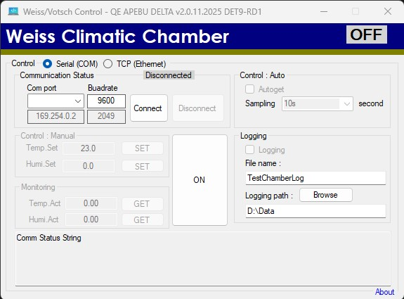
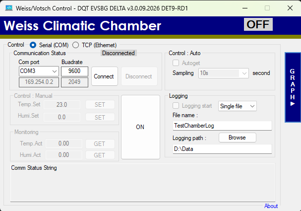
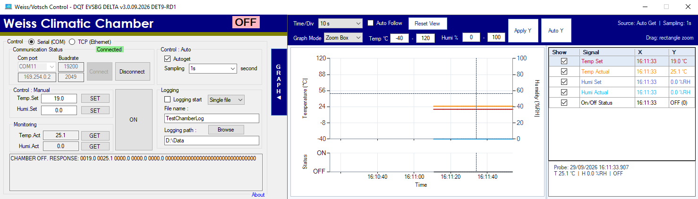
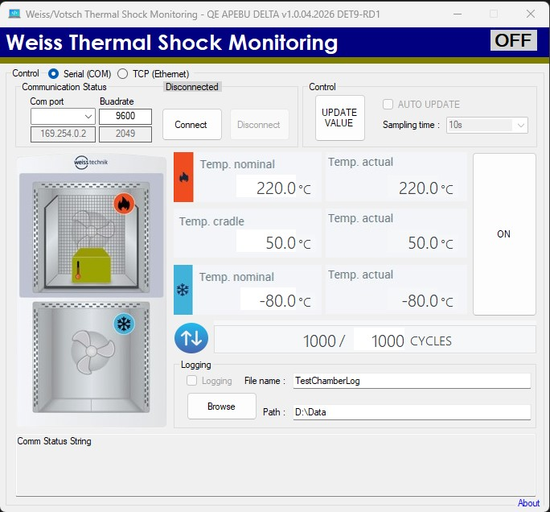

<div align="center">

# 🌡️ Weiss/Votsch Chamber Control System

### Professional Environmental Chamber Management Software
**Built with C# | Real-time Monitoring | Multi-Chamber Support**

[](https://opensource.org/licenses/MIT)
[](https://docs.microsoft.com/en-us/dotnet/csharp/)

[](https://github.com/TOPTUBBY/CSharpe-WeissControl)


</div>

---

## 📋 Overview

A **robust C# application** for automated control and real-time monitoring of **Weiss/Votsch** environmental testing chambers. This software enables precise temperature and humidity management with comprehensive data logging and multi-chamber support.

### ✨ Key Features

| Feature | Description |
|---------|-------------|
| 🎮 **Real-time Control** | Direct chamber communication with live parameter adjustment |
| 📊 **Data Logging** | Continuous monitoring and recording of all chamber metrics |
| 🔄 **Single & Multi-Chamber** | Flexible implementations for different operational needs |
| 📈 **Interactive Realtime Graph** | Pin-style graph workspace with zoom, pan, probe, selectable signals, and adjustable axes |
| 🔗 **Serial Protocol** | Full Weiss/Votsch protocol compliance |
| 💾 **Persistent Storage** | Complete audit trail of all operations |

---

## 📁 Project Structure

```
CSharpe-WeissControl/
├── 🎯 WeissChamberController/          # Single chamber implementation
├── 🔄 WeissChamberController-Multi/    # Multi-chamber orchestration
├── ⚡ WeissChamberController-Shock/    # Thermal shock chamber control
├── 📖 weiss-votsch_protocol.txt        # Protocol specifications
├── ⚖️  LICENSE                         # MIT License
└── 📘 README.md                        # This file
```

---

## 🚀 Quick Start

### Prerequisites

- ✅ **.NET Framework 4.5**
- ✅ **Visual Studio 2019+** or compatible IDE
- ✅ **Hardware**: Connected Weiss/Votsch chamber unit
- ✅ **Connection**: Serial/COM port or appropriate interface

### Installation Steps

1️⃣ **Clone the Repository**
```bash
git clone https://github.com/TOPTUBBY/CSharpe-WeissControl.git
cd CSharpe-WeissControl
```

2️⃣ **Open in Visual Studio**
```
File → Open → Project/Solution
Select the .sln file
```

3️⃣ **Review Protocol Documentation**
```
📄 Read: weiss-votsch_protocol.txt
```

4️⃣ **Build & Configure**
```
Build → Build Solution (Ctrl+Shift+B)
Configure chamber parameters
Run the application
```

---

## 💡 Usage

### 🎯 Single Chamber Mode

<div align="center">
  
</div>

Use **`WeissChamberController`** when managing a single environmental chamber.

```
✓ Simpler configuration
✓ Lower resource usage
✓ Ideal for individual testing stations
```

### 🔄 Multi-Chamber Mode

Use **`WeissChamberController-Multi`** for controlling multiple chambers simultaneously.

#### Main control window — graph collapsed

<div align="center">
  
</div>

#### Realtime graph workspace — graph expanded

<div align="center">
  
</div>

```
✓ Synchronized operation
✓ Centralized monitoring
✓ Batch testing capabilities
✓ Load balancing
✓ Interactive realtime graph workspace
```

### 📈 Realtime Graph Workspace (`WeissChamberController-Multi`)

The graph is implemented as a collapsible right-side workspace. Click the vertical **GRAPH ▶** tab to open it and **GRAPH ◀** to close it. The normal controller remains available on the left while the graph is open.

#### Plotted signals

| Signal | Display color | Value |
|--------|---------------|-------|
| **Temp Set** | Red | Temperature setpoint (°C) |
| **Temp Actual** | Orange | Measured temperature (°C) |
| **Humi Set** | Blue | Humidity setpoint (%RH) |
| **Humi Actual** | Light blue | Measured humidity (%RH) |
| **On/Off Status** | Black/gray | Chamber status on a separate status plot |

Use the **Show** checkbox in the signal table to display or hide each series. The **X** and **Y** columns show the latest reading, or the selected probe reading after clicking the chart.

#### Graph controls

| Control | How to use |
|---------|------------|
| **Time/Div** | Select the time represented by each horizontal division. The graph uses 10 divisions: `10 s` shows 100 seconds, `30 s` shows 5 minutes, `1 min` shows 10 minutes, `5 min` shows 50 minutes, `10 min` shows 100 minutes, `30 min` shows 5 hours, `1 hr` shows 10 hours, and `6 hr`/`All (24 hr)` show up to 24 hours. |
| **Auto Follow** | Keep the latest sample at the right side of the graph. It is disabled automatically when probing, zooming, or panning. |
| **Reset View** | Clear probe/zoom positions, restore the selected Time/Div view, and enable Auto Follow. |
| **Zoom Box** | Select this mode, then hold the left mouse button and drag a rectangle over the value plot. Both the time and value ranges are zoomed to the selected area. |
| **Pan Hand** | Select this mode, then drag left or right to move through the available graph history. |
| **Temp °C / Humi % + Apply Y** | Enter minimum and maximum values for both Y axes, then click **Apply Y** to fix the ranges. Each minimum must be lower than its maximum. |
| **Auto Y** | Return the temperature and humidity Y axes to automatic scaling. |
| **Point Probe** | In **Zoom Box** mode, click a point without dragging. The graph selects the nearest sample and shows its full timestamp, temperature, humidity, and status. |

#### Sampling and history behavior

- When **Autoget** is enabled, new graph samples use the same interval selected in the controller's **Sampling** list.
- When **Autoget** is disabled, the graph continues at that interval by holding the last successfully read values.
- The source and active sampling interval are shown in the top-right corner of the graph toolbar.
- The graph retains up to 24 hours of history. In **All (24 hr)** mode, older data gradually fades toward the left side.
- Rendering is automatically reduced for long histories to keep interaction responsive while retaining the newest point.
- Up to 30,000 samples are stored and up to 4,000 representative samples are rendered at one time.

> The realtime graph feature currently applies to **`WeissChamberController-Multi`** only. Thermal Shock graph support will be added after this implementation is stable.

### ⚡ Thermal Shock Chamber Mode

<div align="center">
  
</div>

Use **`WeissChamberController-Shock`** for managing thermal shock testing chambers.

```
✓ Hot/Cold zone management
✓ Basket transfer control
✓ Rapid temperature cycle monitoring
✓ Dedicated shock test profiling
```

---

##  Protocol Information

The system communicates with chambers using a **binary serial protocol**:

### Data Flow

```
RECEIVED FROM CHAMBER (RxD)
Temperature | Humidity | Settings | Control Flags | Device ID
    ↓
PROCESSED BY APPLICATION
    ↓
SENT TO CHAMBER (TxD)
Commands | Parameters | Configuration
```

### Supported Chamber Models

| Model | Values | Control Bits |
|-------|--------|--------------|
| V08_VCS_7080_10 | 7 parameters | 32-bit control |
| V26_C7_1000_E | 5 parameters | 32-bit control |
| W27_ESS_C_1000_70_5 | 5 parameters | 32-bit control |
| W28_ESS_C_1300_70_10 | 7 parameters | 32-bit control |
| W29_ESS_T_1700_70_8 | 5 parameters | 32-bit control |
| Thermal Shock Series | 15 parameters | 32-bit control |

*See `weiss-votsch_protocol.txt` and `thermalshock_protocol.txt` for complete protocol details*

#### ⚡ Thermal Shock Protocol Overview
The thermal shock protocol uses ASCII-2 DYNAMIC configuration spanning 47 data points per I-String, expanding standard control with:
- **15 Value Parameters**: Hot/Cold chamber temperatures, Cradle position, Cycles, and Defrost settings.
- **32-Bit Control Flags**: Managing precise hardware like Lift control, LN2 injection, Comp. air/GN2, and Custom outputs.

---

## 🎯 Core Components

### 🔧 Control Module
- ⚙️ **Standard Chambers:** Parameter management, set-point configuration, and ramp rate control.
- ⚡ **Shock Chambers:** Multi-zone orchestration (Hot/Cold/Cradle), precise Basket position handling, and robust cycle tracking (supports models like `W7_Shock`, `W11_Shock`).

### 📊 Logging Module
- 📈 Real-time data capture across all active test zones.
- 💾 Persistent storage and complete audit trails.
- 📋 CSV/Log export for detailed reporting.

### 🔌 Communication Interface (`ITransport`)
- 🌐 **TCP/IP (Ethernet):** Network-based controller communication via `TcpTransport`.
- 🔗 **Serial (RS-232/RS-485):** Direct COM port integration via `SerialTransport`.
- ⚡ Real-time continuous data streaming and dynamic parsing.
- 🛡️ Advanced connection state management, timeout handling, and automatic recovery built-in.

---

## 📝 Configuration

Each chamber implementation includes configuration files for:

```
🔹 Serial port settings
🔹 Baud rate & communication parameters
🔹 Default set-points
🔹 Logging intervals
🔹 Alarm thresholds
```

---

## 🐛 Troubleshooting

| Issue | Solution |
|-------|----------|
| ❌ No connection | Check COM port, baud rate, cables |
| ❌ Data not logging | Verify write permissions, disk space |
| ❌ Control not responding | Review protocol format, check chamber power |
| ❌ Multi-chamber sync issues | Ensure adequate serial buffer size |

---

## 📄 License

This project is licensed under the **MIT License**  
See [LICENSE](LICENSE) file for complete terms

```
✅ Free for commercial use
✅ Free for private use
✅ Modification allowed
⚠️ Include original license notice
```

---

## 📞 Support & Contribution

### 🐛 Report Issues
[Open an Issue](https://github.com/TOPTUBBY/CSharpe-WeissControl/issues)

### 🤝 Contribute
[Submit a Pull Request](https://github.com/TOPTUBBY/CSharpe-WeissControl/pulls)

### 📧 Contact
For questions or support: [TOPTUBBY](https://github.com/TOPTUBBY)

---

## 📊 Project Status

| Aspect | Status |
|--------|--------|
| Development | 🟢 Active |
| Latest Update | 🕐 September 29, 2026 |
| Stability | 🟢 Stable |
| Production Ready | ✅ Yes |

---

## 🎓 Version History

| Version | Date | Notes |
|---------|------|-------|
| **v3.0.09.2026** | 2026-09-29 | 📈 Added a collapsible realtime graph workspace to `WeissChamberController-Multi` with Temp Set/Actual, Humi Set/Actual, and On/Off Status signals |
| | | 🖱️ Added point probe, rectangle zoom, Pan Hand, Auto Follow, and Reset View controls |
| | | 📐 Added fixed Temp/Humidity Y-axis ranges with Apply Y and automatic scaling with Auto Y |
| | | ⏱️ Added Time/Div selections from 10 seconds through All (24 hours), sampling linked to Autoget, hold-last-value mode, long-history fading, and rendering decimation |
| | | 🎨 Moved the complete graph workspace layout into the WinForms Designer and refined the fixed-window layout, timestamps, legends, and value table |
| **v1.1.08.2026** | 2026-08-20 | 🎉 Added logging mode function for WeissChamberController |
| **v1.1.08.2026** | 2026-08-20 | 🎉 Added logging mode function for WeissChamberController-Multi |
| **v2.1.08.2026** | 2026-08-20 | 🎉 Added logging mode function for WeissChamberController-Shock |
| **v1.0.04.2026** | 2026-04-11 | 🎉 Added WeissChamberController-Shock |
| **v2.0.11.2025** | 2026-03-05 | 🎉 Initial Release |
| | | ✨ Single chamber support |
| | | ✨ Multi-chamber orchestration |
| | | ✨ Complete protocol implementation |

---

<div align="center">

### 🚀 Ready to get started?

**[📖 Standard Protocol](weiss-votsch_protocol.txt)** • **[⚡ Thermal Shock Protocol](thermalshock_protocol.txt)**

[🐛 Report Issue](https://github.com/TOPTUBBY/CSharpe-WeissControl/issues) • [💬 Discussions](https://github.com/TOPTUBBY/CSharpe-WeissControl/discussions)

---

**Made with ❤️ for precise environmental control**

*Last Updated: August 20, 2026 | MIT License © 2026*

</div>
